<div align="center">

# 🔐 Week 1 — Cybersecurity Lab: One Attacker, Two Targets

**A three-machine isolated penetration-testing lab built in VirtualBox**
</div>

<p align="center">
  
  
  
  
  
  
  
  
  
  
  
  
</p>

---

## 📌 Week 1 Summary

A penetration-testing lab with one machine is a tutorial. A lab with an attacker and something to attack is an environment you can actually work in.

Week 1 built three virtual machines on a single isolated VirtualBox NAT Network:

| | Machine | Role | Address |
|---|---|---|---|
| 🐉 | **Kali Linux 2026.2** | Attacker | `10.0.0.2/24` |
| 🤖 | **Android-x86 9.0 r2** | Target — mobile | `10.0.0.9/24` |
| 🪟 | **Windows 10 Home** | Target — desktop | `10.0.0.10/24` |

Every address is static, every link is verified in both directions, and both targets are snapshotted so a broken exercise costs twenty seconds instead of an afternoon.

**The two extra projects are documented in full in their own repositories:**

| Project | Repository |
|---|---|
| 🪟 Windows 10 target VM | [NETWORKWALKS-B083-WK1-PMx-WINDOWS10-TARGET-VM-LAB](https://github.com/btk3d/NETWORKWALKS-B083-WK1-PMx-WINDOWS10-TARGET-VM-LAB) |
| 🤖 Android-x86 target VM | [NETWORKWALKS-B083-WK1-PMx-ANDROID-X86-TARGET-VM-LAB](https://github.com/btk3d/NETWORKWALKS-B083-WK1-PMx-ANDROID-X86-TARGET-VM-LAB) |

This repository is the overview: the architecture, the shared network design, the consolidated verification, and what the week actually taught.

---

## 🏗️ Lab Architecture

```text
                    ┌──────────────────────────────┐
                    │        Host Machine          │
                    │   Windows  ·  VirtualBox     │
                    └──────────────┬───────────────┘
                                   │
              ┌────────────────────┴────────────────────┐
              │      VirtualBox NAT Network             │
              │      "NatNetwork"  ·  10.0.0.0/24       │
              │      Gateway 10.0.0.1 · DNS 8.8.8.8     │
              │      DHCP disabled — static addressing  │
              └───┬─────────────────┬─────────────────┬─┘
                  │                 │                 │
        ┌─────────┴────────┐ ┌──────┴─────────┐ ┌─────┴──────────┐
        │  🐉 Kali Linux   │ │ 🤖 Android-x86 │ │ 🪟 Windows 10  │
        │  ATTACKER        │ │ TARGET         │ │ TARGET         │
        │  10.0.0.2/24     │ │ 10.0.0.9/24    │ │ 10.0.0.10/24   │
        │  eth0            │ │ wlan0/VirtWifi │ │ Ethernet       │
        └────────┬─────────┘ └───────┬────────┘ └───────┬────────┘
                 │                   │                  │
                 └───────────────────┴──────────────────┘
                     all three reach each other directly

        Reserved for future lab machines: 10.0.0.11 – 10.0.0.99
```

---

## ⚙️ Shared Network Design

| 🧩 Setting          | ⚙️ Value                          |
| ------------------- | --------------------------------- |
| 🧰 Hypervisor       | Oracle VirtualBox                 |
| 🌐 Virtual Network  | NAT Network — `NatNetwork`        |
| 📡 Network Address  | 10.0.0.0/24                       |
| 🚪 Default Gateway  | 10.0.0.1                          |
| 🌍 DNS Server       | 8.8.8.8                           |
| 🔌 DHCP             | Disabled — every host is static   |
| 🔧 Adapter Type     | Intel PRO/1000 MT Desktop         |
| 🔮 Future VM Range  | 10.0.0.11 – 10.0.0.99             |

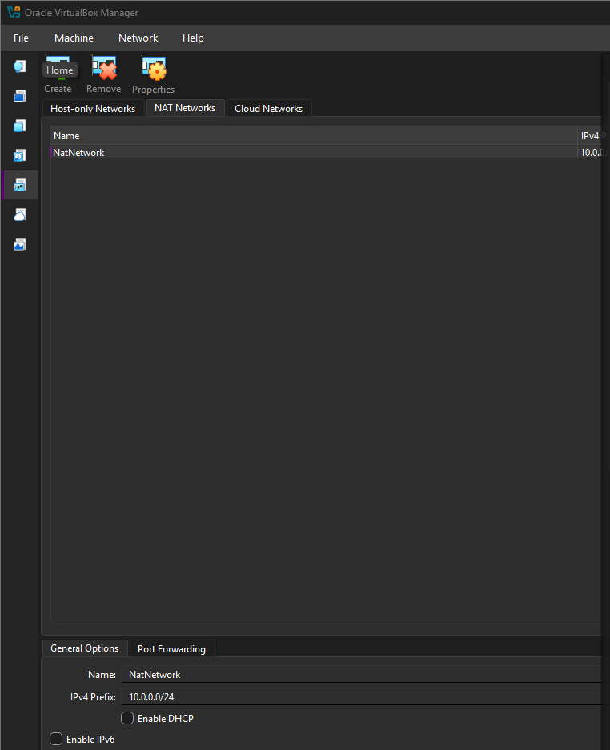

### Why a NAT Network and not plain NAT

This single choice decides whether the lab works at all.

**Plain NAT** gives each VM its own private translation layer and its own isolated `10.0.2.x` address. Each VM reaches the Internet, and none of them can see any other. A lab built this way looks completely correct — every machine has an IP, every machine browses the web — and it cannot do a single thing you built it for.

**A NAT Network** is a shared virtual switch. Every VM attached to it sits on one subnet, reaches every other VM directly, and still gets outbound Internet through the host. That is the entire requirement for an attacker/target lab.

DHCP was left disabled deliberately. Every future exercise refers to "the Windows target at 10.0.0.10". If addresses move, every command, screenshot and report written this week goes stale.

---

## 🖥️ The Three Machines

### 🐉 Kali Linux 2026.2 — Attacker · `10.0.0.2/24`

The offensive platform. Nmap, Wireshark, Metasploit and the rest of the Kali toolchain, pointed at two targets that are entirely the author's own.

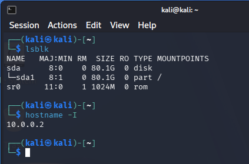

---

### 🪟 Windows 10 Home — Desktop target · `10.0.0.10/24`

4 GB RAM, 40 GB dynamically allocated VDI, installed from the official Microsoft ISO. Statically addressed through the IPv4 properties dialog and left with Windows Defender Firewall **on**, because a Windows box with the firewall switched off is not the box you will meet in the field.

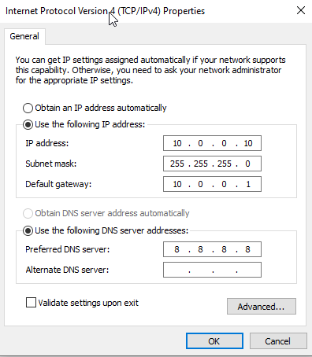

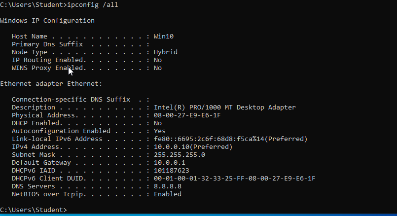

`DHCP Enabled: No` is the line that matters — the address survives reboots.

**→ Full write-up:** [NETWORKWALKS-B083-WK1-PMx-WINDOWS10-TARGET-VM-LAB](https://github.com/btk3d/NETWORKWALKS-B083-WK1-PMx-WINDOWS10-TARGET-VM-LAB)

---

### 🤖 Android-x86 9.0 r2 — Mobile target · `10.0.0.9/24`

2 GB RAM, 10 GB ext4, installed by hand through the text-mode installer — partition, bootable flag, filesystem, GRUB. Most of what security teams defend today runs on a phone, and a lab with only desktop targets never touches that surface.

Android-x86 does not expose the VirtualBox adapter as Ethernet. It wraps it in a virtual Wi-Fi layer called **VirtWifi** on `wlan0`, and asks for a **prefix length** rather than a subnet mask.

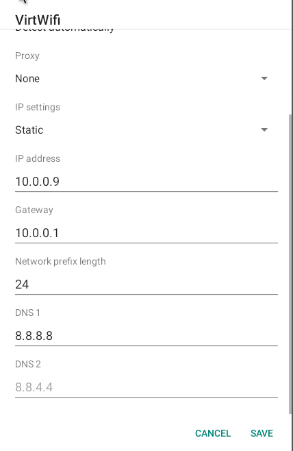

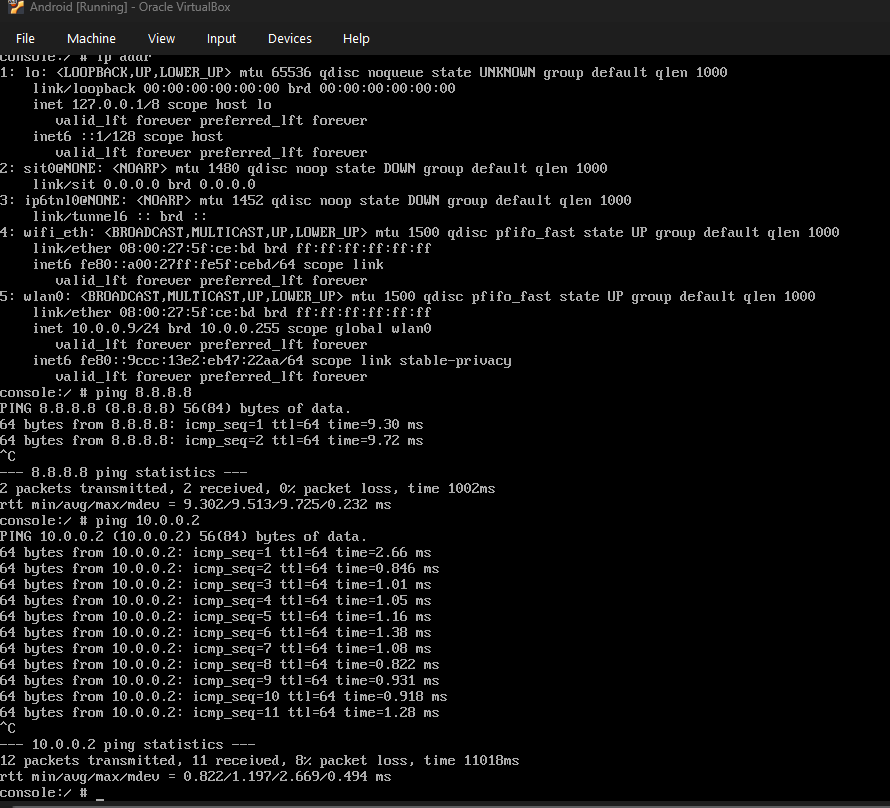

**→ Full write-up:** [NETWORKWALKS-B083-WK1-PMx-ANDROID-X86-TARGET-VM-LAB](https://github.com/btk3d/NETWORKWALKS-B083-WK1-PMx-ANDROID-X86-TARGET-VM-LAB)

---

## 🔎 Verification

Reachability was tested in both directions on every link. One-way success proves nothing — when only one direction works, the fault is almost always a host firewall rather than the network.

| ✅ Test                      | 🧾 Command                | 🎯 Result                        |
| --------------------------- | ------------------------- | -------------------------------- |
| 🪟 Windows → Kali           | `ping 10.0.0.2`           | 10/10 packets, **0% loss**       |
| 🐉 Kali → Windows           | `ping 10.0.0.10`          | 6/6 packets, **0% loss**         |
| 🤖 Android → Kali           | `ping 10.0.0.2`           | 11/12 packets, 8% loss           |
| 🐉 Kali → Android           | `ping 10.0.0.9`           | 10/10 packets, **0% loss**       |
| 🌍 Android → Internet       | `ping 8.8.8.8`            | 2/2 packets, **0% loss**         |
| 🪟 Windows IP               | `ipconfig /all`           | 10.0.0.10, DHCP Enabled: No      |
| 🤖 Android interface        | `ip addr`                 | `wlan0` 10.0.0.9/24              |
| 🐉 Kali IP                  | `hostname -I`             | 10.0.0.2                         |

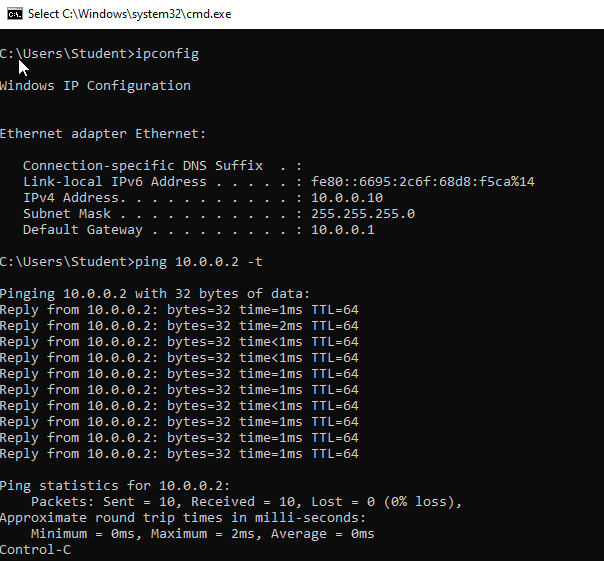

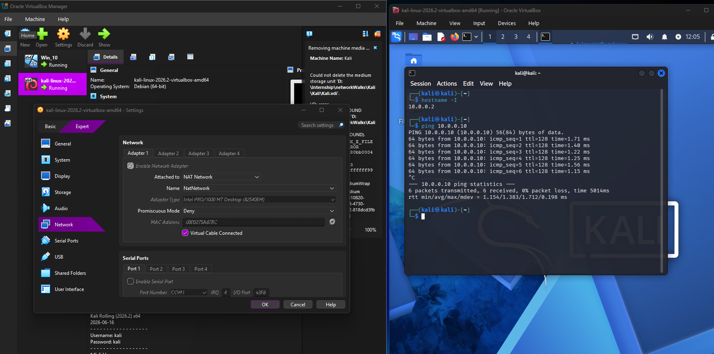

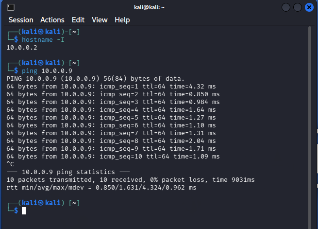

The 8% loss on the Android → Kali run is a single dropped packet out of twelve on a virtualised Wi-Fi interface. It is reported here as measured rather than rounded to a tidier number.

---

## 📸 Baseline Snapshots

Both targets were snapshotted the moment the lab was verified, before any destructive work.

```text
Windows_10 Smaps1  — clean Windows 10 target, network configured
Kali_snap1         — clean Kali attacker, network configured
```

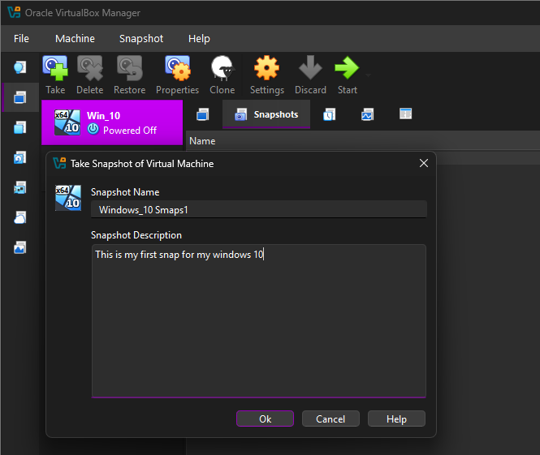

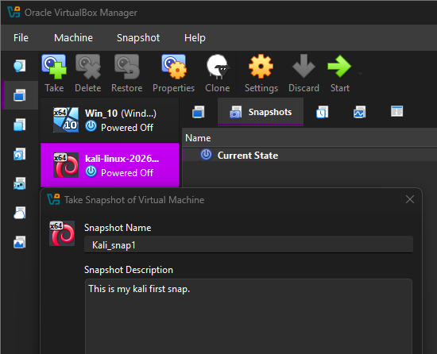

Snapshots taken after something breaks are worthless. Taking them at the known-good point is what makes destructive testing affordable.

---

## 🐞 Problems Encountered & Solutions

Two real blockers came up during this week's work. Both were on the Android VM, and both are the kind that stop the build completely rather than slow it down.

### 1. `This kernel requires an x86-64 CPU, but only detected an i686 CPU`

The Android VM refused to boot the installer at all.

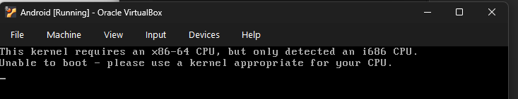

```text
This kernel requires an x86-64 CPU, but only detected an i686 CPU.
Unable to boot - please use a kernel appropriate for your CPU.
```

**Cause:** the 64-bit ISO was attached to a VM whose OS version was set to a 32-bit type. VirtualBox builds the guest's virtual CPU from that setting, so it presented a 32-bit processor and the 64-bit kernel correctly refused to run.

The message reads like a hardware fault on the host. It is not. The host CPU is fine — the mismatch is entirely inside the VM definition, and that is what makes this one slow to diagnose.

**Fix:**

1. Power the VM off.
2. **Settings → General → Basic → Version**: set a 64-bit Linux profile.
3. **Settings → System → Processor**: confirm **Enable PAE/NX** is ticked.
4. Confirm Intel VT-x / AMD-V is enabled in the host BIOS/UEFI.
5. Start the VM again — the installer boots.

The rule underneath: ISO architecture and VM architecture are one decision, not two.

### 2. Android-x86 has no Ethernet settings page

Every generic guide sends you to **Settings → Network & Internet → Ethernet** to set the static IP. That page does not exist on Android-x86, so there is nothing to click and no obvious next step.

**Cause:** Android's networking stack is built for mobile hardware. Android-x86 therefore maps the wired VirtualBox adapter onto the path Android already understands — a virtual Wi-Fi network called **VirtWifi**, on interface `wlan0`.

**Fix:** configure the address under **Settings → Network & Internet → Wi-Fi → VirtWifi → IP settings → Static**. Note that Android asks for a **network prefix length (24)** rather than a subnet mask.


---

## 💡 What Week 1 Taught

### 1. One setting decides whether the lab exists

NAT versus NAT Network is not a preference. Plain NAT produces a lab where three machines each have a valid IP, each reach the Internet, and none can see each other — correct-looking and completely useless. Understanding *why* (per-VM translation layer versus shared virtual switch) is what makes the fix obvious instead of accidental.

### 2. The error message names the symptom, not the cause

`i686 CPU` points at a processor. The actual fault was a dropdown in the VM wizard. Learning to read an error as a description of what the system observed — rather than a diagnosis of what went wrong — is the single most transferable skill in this week's work.

### 3. Every platform is its own animal

Windows configures an Ethernet adapter through a dialog asking for a subnet mask. Android configures the same virtual hardware through a fake Wi-Fi network asking for a prefix length. Assuming the next platform works like the last one is how a ten-minute task becomes a two-hour one.

### 4. Static addressing is documentation

Fixed addresses cost five minutes once and keep every command, screenshot and report accurate for the rest of the program.

### 5. Reachability is directional

Testing both directions, and knowing that a one-way failure means a host firewall rather than a network fault, separates a five-minute fix from an afternoon of guessing.

### 6. The problems are the deliverable

A lab that works is worth little if nobody can rebuild it. The boot failure and the missing Ethernet page are the two things another student attempting this will actually hit, and recording them with the real error text is what makes this document more useful than the guide it started from.

---

## 🚀 What the Lab Can Now Support

With three hosts on one isolated subnet:

- Host discovery and port scanning across a mixed-OS network
- SMB and NetBIOS enumeration against Windows
- Mobile application security testing and APK analysis on Android
- HTTPS interception and packet capture between known endpoints
- Service and OS fingerprinting across three very different stacks
- Exploitation and post-exploitation practice with a rollback point
- Blue-team log review on both Windows and Android

---

## 🔐 Security & Ethical Use

This laboratory is built strictly for education and authorized testing.

- The lab is isolated on a private NAT Network.
- All targets are machines built and owned by the author.
- Tools and techniques practised here must never be used against systems without explicit written authorization.
- Unauthorized access to computer systems is a criminal offence in most jurisdictions.

---

## 🔗 Tools & Resources

- **VirtualBox:** https://www.virtualbox.org/wiki/Downloads
- **Kali Linux:** https://www.kali.org/get-kali/
- **Windows 10 ISO (Microsoft):** https://www.microsoft.com/software-download/windows10
- **Android-x86:** https://www.android-x86.org/download
- **VirtualBox NAT Network documentation:** https://www.virtualbox.org/manual/ch06.html

---

## 👤 Author

**Aime Botuku**\
Team Lead — Batch B083, Networkwalks Technologies Cybersecurity Program\
Cybersecurity student, Highline College

LinkedIn: https://www.linkedin.com/in/aime-botuku-74867690/\
GitHub: https://github.com/btk3d

---

## 📌 Project Information

**Program:** Cybersecurity at Networkwalks | **Batch:** B083 | **Week:** 01 | **Project:** WK1 — Cybersecurity Lab Setup + PMx Extra Projects | **Repository:** GitHub
